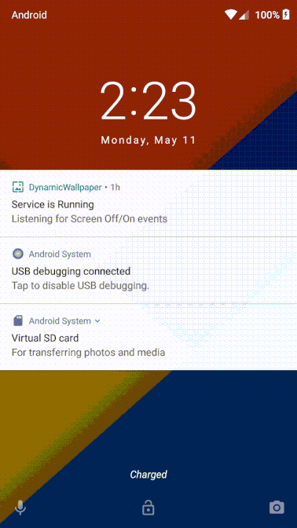

# DynamicWallpaper
Android- Automatically change Home or Lock screen wallpaper whenever screen gets unlocked or locked

### Functionalities

1. Change home screen wallpaper whenever screen gets unlocked: <b>Done</b>
2. Change lock screen wallpaper whenever screen gets locked: <b>Todo</b>

### Technical Tasks

1. Settings screen to coose for event (screen lock/unlock): <b>Pending</b>
2. Asking `WRITE_EXTERNAL_STORAGE` permission on app launch: <b>Pending</b>
3. Interface where user can add wallpapers: <b>Pending</b>
4. Interface to enable/disable this app: <b>Pending</b>

### Demo GIF

## Tutorial

### [Android Services](https://developer.android.com/guide/components/services)

A Service is an application component that can perform long-running operations in the background, and it doesn't provide a user interface. 
Another application component can start a service, and it continues to run in the background even if the user switches to another application.

### [Broadcast Receiver](https://developer.android.com/guide/components/broadcasts)

Android apps can send or receive broadcast messages from the Android system and other Android apps, similar to the publish-subscribe design pattern. 
These broadcasts are sent when an event of interest occurs. For example, the Android system sends broadcasts when various system events occur, such as when the system boots up or the device starts charging. Apps can also send custom broadcasts.

### [WorkManager](https://developer.android.com/topic/libraries/architecture/workmanager/basics)

With `WorkManager`, developers can easily set up a task and hand it off to the system to run under the specified conditions.
A task is defined using the `Worker` class. The `doWork()` method is run synchronously on a background thread provided by WorkManager.
While a `Worker` defines the unit of work, a `WorkRequest` defines how and when work should be run. Tasks may be one-off or periodic.

## Working of DynamicWallpaper

1. App always keeps running a Foreground Service
2. This service registers a Broadcast Receiver
3. This broadcast receiver listens for phone screen lock & unlock events
4. Whenever screen is unlocked, receiver calls a method `setRandomWallpaper`
5. This method picks a random wallpaper from `dynamic-wallpaper` directory (inside phone storage)
6. If this directory doesn't exists then it creates one
7. User must manually add some wallpapers to this directory (until UI is built for it - Todo)
8. User must explicitly grant `WRITE_EXTERNAL_STORAGE` to this app (until app starts asking for it automatically on launch - Todo)
9. Depending upon the devices, User might have to explicitly grant AutoStart permission to the app

### How does app manage to keep service running all the time?

1. Whenever Service (`MyService.java`) is destroyed, it sends broadcast intent to a Receiver (`MyReceiver.java`) from `onDestroy` lifecycle method
2. This custom Broadcast Receiver starts the Service again
3. `onDestroy` method of Service (`MyService.java`) is not always guaranteed to be called and hence it might not get started again
4. To overcome this limitation, app schedules a `PeriodicWorkRequest` via `WorkManager`
5. This Background Job runs on every 16 mins and it's job is to restart the Service if not already running
6. This Job is also responsible for launching Service for the very first time
7. Android system guarantees that this Background Job will run given that it has AutoStart permission (even if device restarts)
